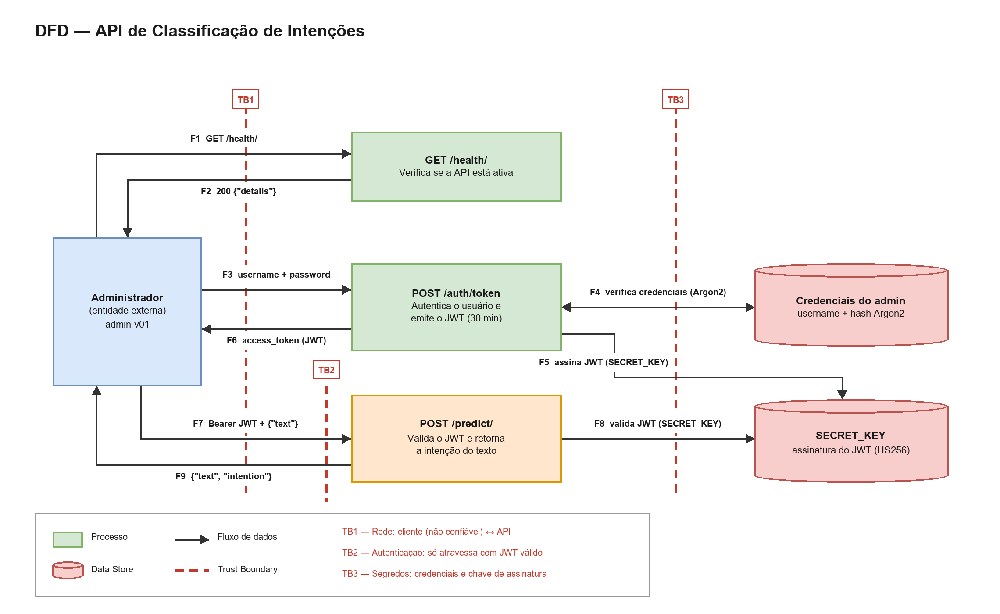

# DFD e Tríade CIA — API de Classificação de Intenções

---

## Quais são os componentes do DFD?

| Tipo | Componente | Descrição |
|---|---|---|
| Entidade externa | **Administrador** | Usuário `admin-v01`, único autorizado a consumir a API |
| Processo | **GET /health/** | Verifica se a API está ativa. Rota pública, sem autenticação |
| Processo | **POST /auth/token** | Autentica o usuário e emite um JWT HS256 válido por 30 minutos |
| Processo | **POST /predict/** | Valida o JWT e retorna a intenção do texto recebido |
| Data Store | **Credenciais do admin** | `username` e hash Argon2 da senha, em memória |
| Data Store | **SECRET_KEY** | Chave usada para assinar e verificar os JWTs (HS256) |

---

## Quais são as entradas do sistema?

| Fluxo | Entrada | Origem | Destino |
|---|---|---|---|
| F1 | Requisição `GET /health/`, sem credenciais | Administrador | `GET /health/` |
| F3 | `username` + `password` (form-urlencoded) | Administrador | `POST /auth/token` |
| F7 | Header `Authorization: Bearer <JWT>` + corpo `{"text": "..."}` | Administrador | `POST /predict/` |
| F4 | Hash Argon2 da senha, para comparação | Credenciais do admin | `POST /auth/token` |
| F5 | `SECRET_KEY`, para assinar o token | SECRET_KEY | `POST /auth/token` |
| F8 | `SECRET_KEY`, para verificar assinatura e expiração | SECRET_KEY | `POST /predict/` |

---

## Quais são as saídas do sistema?

| Fluxo | Saída | Origem | Destino |
|---|---|---|---|
| F2 | `200 {"details": "Conectado à API."}` | `GET /health/` | Administrador |
| F6 | `200 {"access_token": "eyJ...", "token_type": "bearer"}` ou `401` | `POST /auth/token` | Administrador |
| F9 | `201 {"text": "...", "intention": "..."}` ou `401` | `POST /predict/` | Administrador |

---

## Onde estão as trust boundaries?

| Fronteira | Separa | Fluxos que atravessa | O que muda ao atravessar |
|---|---|---|---|
| **TB1 — Rede** | Cliente e rede (não confiáveis) × aplicação FastAPI | F1, F2, F3, F6, F7, F9 | Todo dado que entra é não confiável e precisa ser validado. O transporte é HTTP, sem TLS |
| **TB2 — Autenticação** | Rotas públicas (`/health/`, `/auth/token`) × rota protegida (`/predict/`) | F7, F9 | Só se atravessa com um JWT íntegro e não expirado; caso contrário a requisição é rejeitada com `401` |
| **TB3 — Segredos** | Código da aplicação × credenciais e chave de assinatura | F4, F5, F8 | Acesso a material sensível. Hoje a senha e a `SECRET_KEY` estão em texto claro no código versionado, o que enfraquece essa fronteira |

---

## O que é confidencial?

- **Senha do administrador** — é o segredo primário; se exposta, todo o controle de acesso cai.
- **`SECRET_KEY`** — quem a obtém consegue forjar tokens válidos sem conhecer a senha.
- **Hash Argon2 armazenado** — não deve ser exposto, mesmo sendo derivado.
- **Token JWT** — é uma credencial *bearer*: quem o possui é tratado como o administrador.
- **Texto enviado para classificação** — pode conter dados do cliente final do atendimento.

Fora do escopo de confidencialidade: a resposta de `/health/` e a documentação Swagger, que são públicas por natureza.

---

## O que precisa de integridade?

- **`SECRET_KEY`** — se alterada ou substituída, a verificação de assinatura deixa de ter valor.
- **Token JWT** — a assinatura HS256 existe justamente para detectar adulteração de `sub` e `exp`.
- **Credenciais armazenadas** — modificar o hash equivale a trocar a senha do administrador.
- **Validação do JWT em `/predict/`** — é o mecanismo que implementa a TB2; falha aqui derruba toda a autorização.
- **Texto de entrada e intenção retornada** — precisam chegar e sair sem modificação no caminho.
- **Código em execução** — não pode ser alterado por um agente externo.

---

## O que deve estar disponível?

- **Processo servidor (FastAPI/Uvicorn)** — se ele cai, todos os componentes caem junto.
- **`GET /health/`** — é o próprio mecanismo de aferir disponibilidade.
- **`POST /auth/token`** — sem emissão de token, nenhuma rota protegida pode ser usada.
- **`POST /predict/`** — é a função de negócio da API.
- **`SECRET_KEY`** — precisa estar acessível ao processo para assinar e validar tokens.

---

## Como cada componente se classifica na tríade CIA?

| Componente | Confidencialidade | Integridade | Disponibilidade |
|---|---|---|---|
| **Administrador** | Alta — credenciais e token não podem ser expostos | Alta — a identidade não pode ser assumida por terceiros | Média — precisa conseguir se autenticar quando necessário |
| **GET /health/** | Baixa — não expõe dado sensível | Baixa — resposta constante | Alta — é o indicador de que a API está no ar |
| **POST /auth/token** | Média — não revela se o usuário existe nem detalhes internos | Alta — é o guardião do acesso; falha aqui concede acesso indevido | Alta — sem ele ninguém obtém token |
| **POST /predict/** | Média — trata texto do cliente e a intenção inferida | Alta — valida o token e produz a resposta de negócio | Alta — é a função principal da API |
| **Credenciais do admin** | Alta — o hash não deve ser exposto | Alta — alterá-lo troca a senha do administrador | Média — sem ele a autenticação é impossível |
| **SECRET_KEY** | Alta — quem a lê consegue forjar tokens válidos | Alta — alterá-la invalida todas as sessões emitidas | Alta — sem ela não se emite nem se valida token |
| **Token JWT (em trânsito)** | Alta — é credencial *bearer* | Alta — a assinatura HS256 é o mecanismo de integridade | Média — sem ele `/predict/` fica inacessível |
| **Fluxo `username` + `password`** | Alta — é o segredo primário | Alta — adulteração permitiria login indevido | Baixa — é um dado pontual, não um serviço |
| **Fluxo `{"text"}` / `{"intention"}`** | Média — pode conter dado do cliente final | Alta — não pode ser adulterado no caminho | Média — entrada abusiva pode degradar o serviço |
| **Processo servidor** | Média — erros não devem vazar caminhos e configuração | Alta — o código em execução não pode ser alterado | Alta — sua queda derruba todo o sistema |

---

## Quais fragilidades o DFD evidencia?

| Onde | Fragilidade | Propriedade afetada |
|---|---|---|
| SECRET_KEY (TB3) | Chave fixa no código e versionada, permitindo forjar tokens válidos | Integridade, Confidencialidade |
| Credenciais (TB3) | Senha do administrador em texto claro no código-fonte | Confidencialidade |
| TB1 | Tráfego em HTTP, sem TLS: senha e token circulam em claro | Confidencialidade |
| POST /auth/token | Sem limite de tentativas, o que permite força bruta e sobrecarga | Disponibilidade, Confidencialidade |
| POST /predict/ | Validação do token não confere se o `sub` corresponde ao administrador | Integridade |
| POST /predict/ | Campo `text` sem limite de tamanho, permitindo payloads muito grandes | Disponibilidade |
| Token JWT | Sem revogação: um token vazado permanece válido até expirar | Confidencialidade, Integridade |
| Swagger | `/docs` e `/openapi.json` públicos, expondo todo o contrato da API | Confidencialidade |

---

## Quais controles já estão implementados?

| Controle | Propriedade reforçada |
|---|---|
| Senha armazenada como hash Argon2, nunca em texto claro na comparação | Confidencialidade |
| Assinatura HS256 com claim `exp` de 30 minutos | Integridade, Confidencialidade |
| `/predict/` protegida por dependência de token válido | Integridade |
| Resposta `401` genérica no login, sem distinguir usuário de senha | Confidencialidade |
| Modelos Pydantic com `extra="forbid"`, rejeitando campos não previstos | Integridade |
| Header `WWW-Authenticate: Bearer` nas respostas `401` | Integridade |
